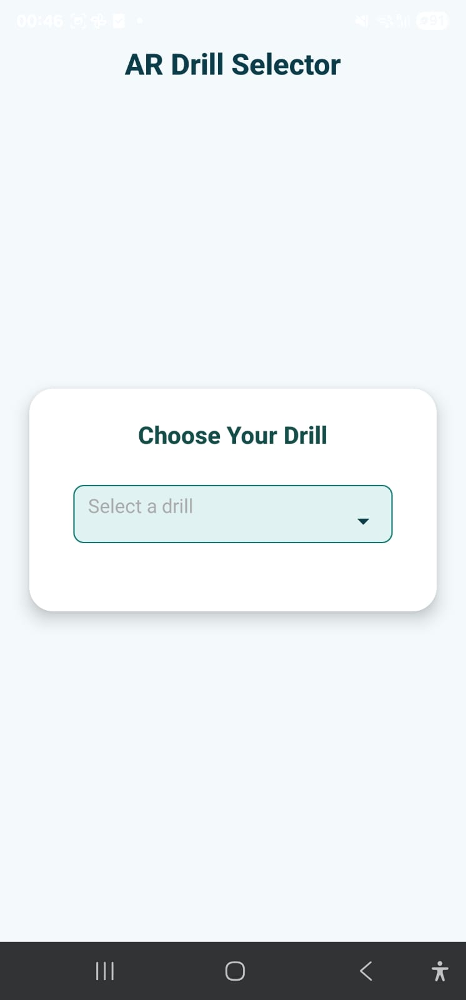
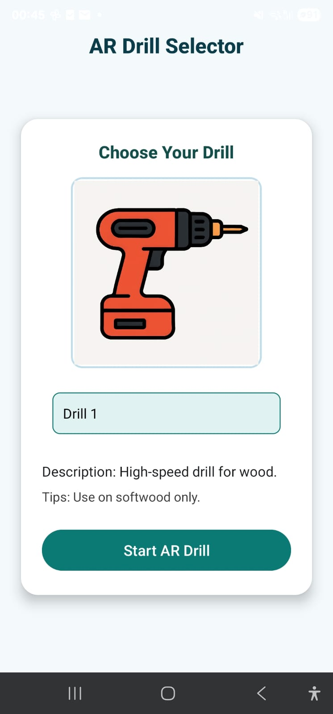
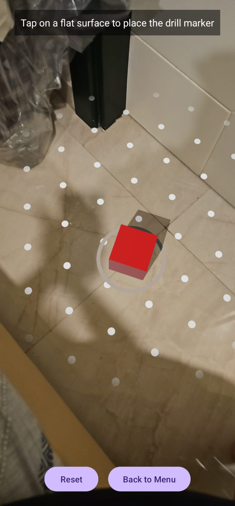

# AR Drill Selector

An Android app that allows users to select from a list of drills and visualise a virtual drill marker in Augmented Reality using ARCore.

##  Features

- Dropdown menu to select one of three drills
- Contextual information for each drill, including:
  - Description
  - Safety Tips
  - Image preview
- Clean, user-friendly UI with custom spinner and themed styling
- AR screen with a virtual red cube marker representing the selected drill
- Reset and Back to Menu buttons on the AR screen

##  Built With

- Kotlin
- Android Studio
- ARCore
- Custom Spinner Adapter
- XML-based layouts

##  Download & Test the APK

Click the link below to download the debug APK and test it on an Android phone (ARCore supported):

👉 [Download APK from Google Drive](https://github.com/pmaitra1/AR-Drill-App/releases/tag/v1.0)

### Installation Instructions
- Open the link on your Android device
- Download the APK
- Go to **Downloads**, tap the file
- If prompted, **allow unknown sources**
- Install and launch

## Screenshots

### Main Drill Selection Screen

---

### Drill Dropdown 

---

### AR Mode – Place the Drill

## 📂 Directory Structure

<pre> app/
├── manifests/
│   └── AndroidManifest.xml
├── java/
│   └── com/example/myapp/
│       ├── MainActivity.kt
│       ├── ARActivity.kt
│       └── DrillAdapter.kt
├── res/
│   ├── layout/
│   │   ├── activity_main.xml
│   │   ├── activity_ar.xml
│   │   ├── custom_spinner_item.xml
│   │   └── custom_spinner_dropdown_item.xml
│   ├── drawable/
│   └── values/
│       └── (colors.xml, styles.xml, etc.)
</pre>

##  Requirements

- Android 7.0+ (Nougat) and ARCore-compatible device
- Android Studio Arctic Fox or later
- Internet access for downloading dependencies

##  License

This project is for academic/demonstration purposes. For commercial use, please modify accordingly and comply with ARCore and Sceneform licensing.
